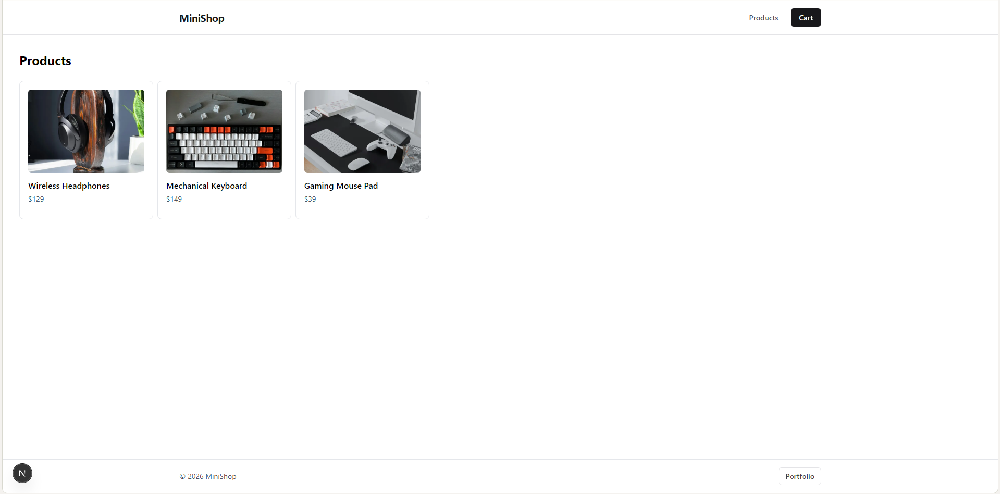
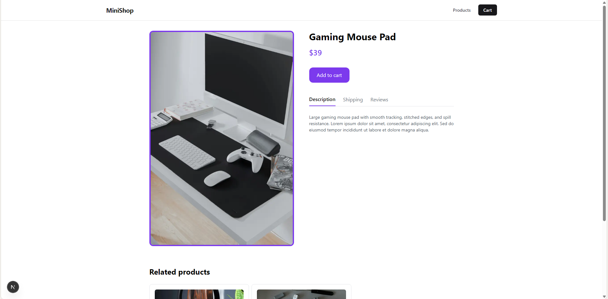
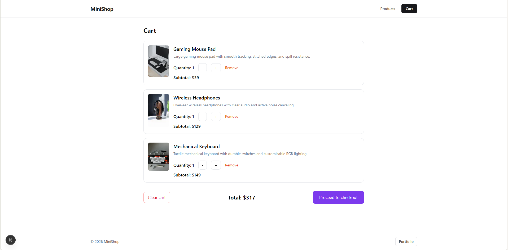
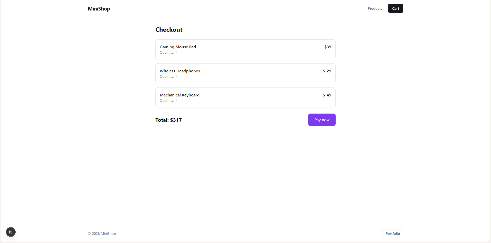
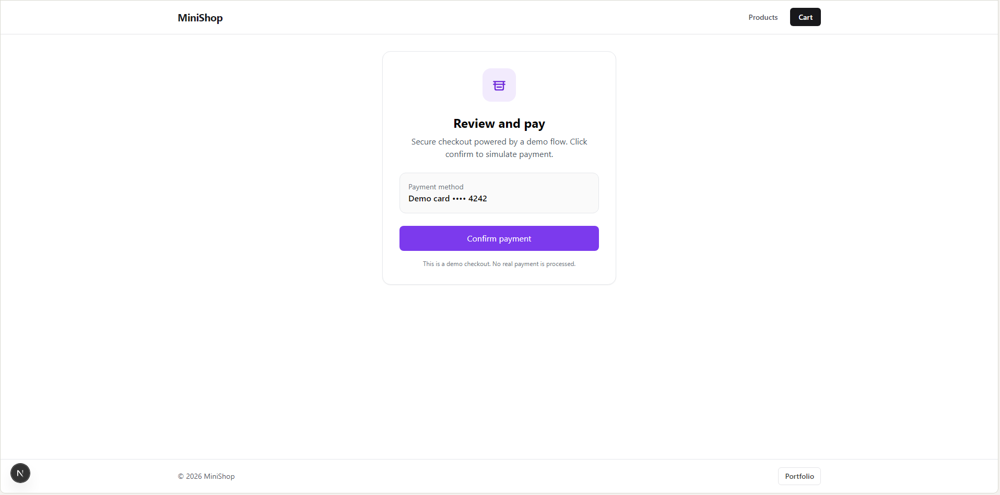
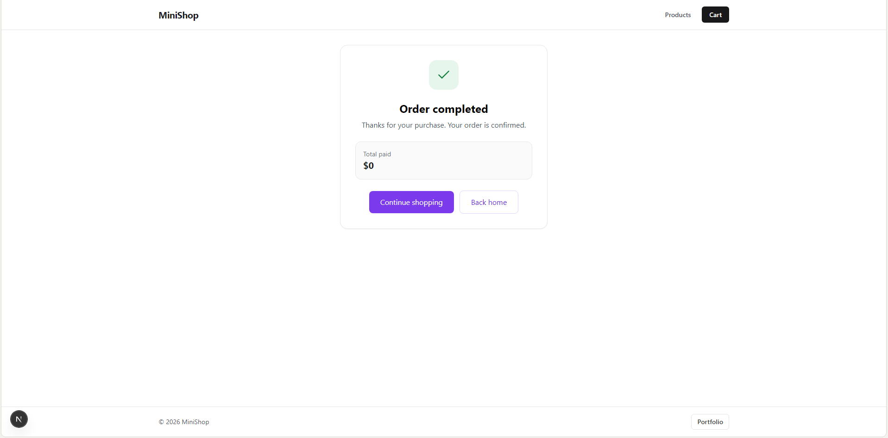
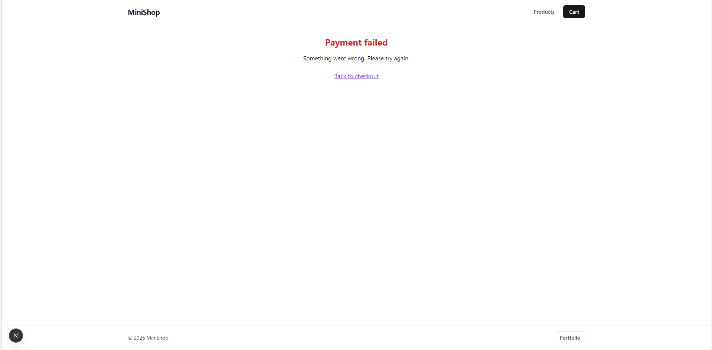

# Mini Ecommerce (Next.js)

Mini Ecommerce is a demo store built with Next.js App Router, TypeScript, and React Context.
The focus is on clean architecture, cart behavior, and a complete fake checkout flow.

Live URL: `https://mini-ecommerce-nextjs-psi.vercel.app`

## Features

- Home page with demo intro and CTA
- Product listing page
- Product detail page by ID
- Cart management
- Add, remove, and update quantities
- Fake checkout flow (`/checkout/pay`, `/checkout/success`, `/checkout/error`)
- Global state via Context API (cart and orders)
- Basic metadata setup for Open Graph and Twitter cards

## Tech Stack

- Next.js (App Router)
- React
- TypeScript
- Tailwind CSS
- Context API
- Fake local product data (`src/lib/products.ts`)

## Screenshots

Add one screenshot per page route and place all files in `public/screenshots/`:

- `home.png` (`/`)
- `products.png` (`/products`)
- `product-detail.png` (`/product/[id]`)
- `cart.png` (`/cart`)
- `checkout.png` (`/checkout`)
- `checkout-pay.png` (`/checkout/pay`)
- `checkout-success.png` (`/checkout/success`)
- `checkout-error.png` (`/checkout/error`)









## Run Locally

```bash
npm install
npm run dev
```

Open: `http://localhost:3000`

## Project Structure (Key Files)

- `src/app/page.tsx` - Home page
- `src/app/products/page.tsx` - Product listing
- `src/app/product/[id]/page.tsx` - Product detail
- `src/app/cart/page.tsx` - Cart page
- `src/app/checkout/*` - Checkout steps
- `src/app/layout.tsx` - App layout and metadata
- `src/lib/products.ts` - Product data source
- `src/app/context/CartContext.tsx` - Cart global state
- `src/app/context/OrdersContext.tsx` - Orders global state

