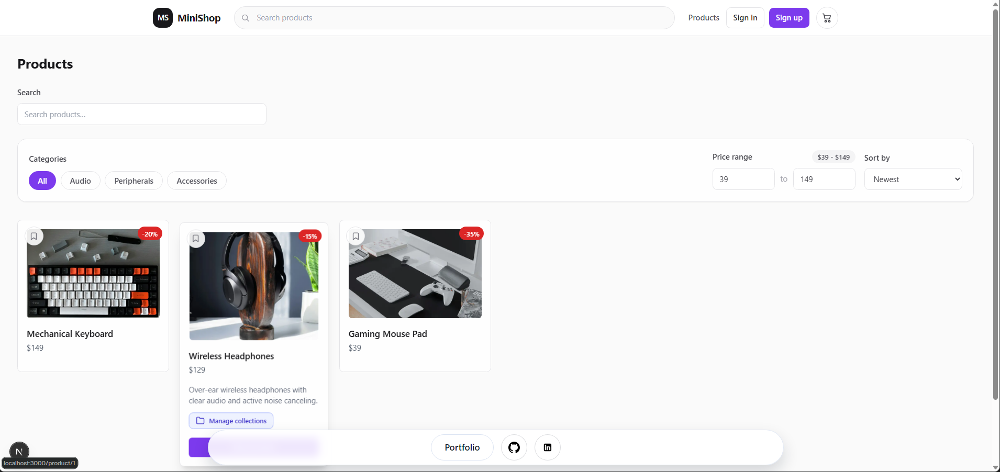
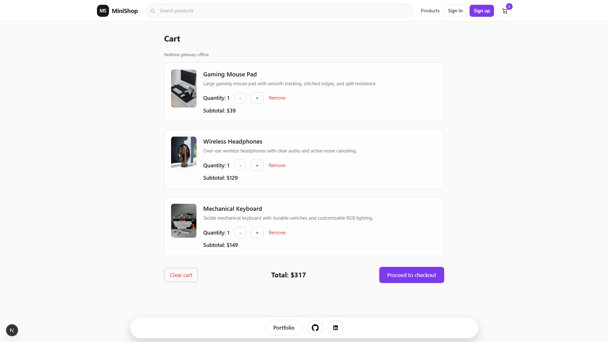

# Mini Ecommerce (Next.js)

A learning-focused ecommerce platform built with Next.js App Router. It demonstrates catalog and checkout flows, **Clerk authentication**, resilient API access, intentional rendering (SSG/ISR), and production-oriented patterns (tests, CI, observability).

**Live:** [mini-ecommerce-nextjs-psi.vercel.app](https://mini-ecommerce-nextjs-psi.vercel.app)  
**Repo:** [github.com/alejosworkstuff/mini-ecommerce-nextjs](https://github.com/alejosworkstuff/mini-ecommerce-nextjs)

## Screenshots

| Home | Product catalog | Cart | Clerk sign-in |
|:---:|:---:|:---:|:---:|
|  |  |  |  |

---

## Problem and Context

I wanted a project that goes beyond static UI and reflects real commerce behavior: dynamic catalog pages, cart/session handling, multi-step checkout, authenticated account areas, and API-backed interactions.

The app showcases frontend-heavy product flows plus backend patterns (REST, GraphQL, Redis caching, WebSockets, Docker, and deployment scaffolding).

## My Role

- Built the full application architecture across UI, API routes, and React contexts
- Implemented product, cart, checkout, favorites, collections, and order flows
- Added **Clerk auth** (proxy middleware, protected routes, per-user orders)
- Implemented a **resilient HTTP client** (timeout, retry, typed errors) and **SSG/ISR** catalog pages
- Integrated Sentry, error boundaries, and structured API logging
- Added Vitest + Playwright tests and GitHub Actions CI (including E2E on push)
- Set up Docker Compose and AWS ECS deployment scaffolding

---

## Tech Stack

- Next.js 16 (App Router), React 19, TypeScript 5 (strict)
- Tailwind CSS 3
- **Clerk** (`@clerk/nextjs`) — OIDC sessions, protected routes
- **Sentry** (`@sentry/nextjs`) — optional error monitoring
- Node.js route handlers (REST + GraphQL)
- Redis 5, WebSockets (`ws`)
- Vitest 4, Testing Library, Playwright
- Docker / Docker Compose, GitHub Actions

---

## Architecture Overview

```text
mini-ecommerce/
├── src/app/              # App Router pages, API routes, error boundaries
├── src/app/context/      # Cart, orders, favorites, collections, messages, realtime
├── src/components/       # UI, ProductsCatalog, ProductDetailView, AccountMenu
├── src/hooks/            # useDebouncedValue, useAsyncResource, useApiMutation, …
├── src/lib/              # http-client, api-client, product-data, order-store
├── src/proxy.ts          # Clerk clerkMiddleware + protected routes
├── docs/                 # Architecture, DoD, testing strategy
├── e2e/                  # Playwright specs
├── realtime-server.mjs   # WebSocket gateway (local/Docker)
├── aws/                  # ECS task definition and deploy notes
└── .github/workflows/    # CI (+ optional AWS deploy)
```

See [`docs/frontend-architecture.md`](docs/frontend-architecture.md) for route-level rendering decisions.

### Routes (UI)

| Path | Purpose | Access |
|------|---------|--------|
| `/` | Home | Public |
| `/products` | Product listing (server data + client filters/search) | Public |
| `/product/[id]` | Product detail (SSG/ISR + client cart/favorites) | Public |
| `/cart`, `/checkout/*` | Cart and checkout flow | Public |
| `/sign-in`, `/sign-up` | Clerk auth UI | Public |
| `/my-purchases` | Order history | Signed in |
| `/favorites`, `/collections`, `/messages`, `/settings` | Account features | Signed in |
| `/admin/orders` | All orders (demo admin) | Signed in + `role: admin` in Clerk |

### API Surface

**REST**

- `GET /api/products`, `GET /api/products/[id]`
- `GET|POST|PATCH /api/orders` — requires Clerk session; scoped by `userId`
- `GET|PUT /api/cart/[sessionId]`

**GraphQL** — `POST /api/graphql` (products public; orders require auth)

**Realtime** — `realtime-server.mjs` at `NEXT_PUBLIC_WS_URL` (default `ws://localhost:4001`)

---

## Key Features

- Product catalog with SSG/ISR detail pages, debounced search, and filters
- Cart with session-backed persistence and multi-step checkout
- **Clerk authentication** — sign-in/up, `UserButton`, protected account routes
- Favorites, collections, messages (demo), and per-user order history
- **HTTP resilience** — centralized client with timeout, retry, `AppError`, `ApiState<T>`
- Dark mode, Open Graph metadata, REST + GraphQL, Redis + WebSocket demos
- **Observability** — Sentry (optional), `error.tsx`, `ErrorBoundary`, structured logs

---

## Authentication (Clerk)

- `clerkMiddleware()` in [`src/proxy.ts`](src/proxy.ts) (includes `/__clerk/:path*` matcher)
- `<ClerkProvider>` in [`src/app/layout.tsx`](src/app/layout.tsx)
- Header: `<Show>`, `<SignInButton>`, `<SignUpButton>`, `<UserButton>` + account menu
- Server routes use `auth()` from `@clerk/nextjs/server` for orders
- Admin: set `publicMetadata.role` to `"admin"` in Clerk for `/admin/orders`

**Local setup:** copy `.env.example` → `.env.local` and add keys from [dashboard.clerk.com](https://dashboard.clerk.com).

**Vercel:** add the same variables in Project → Settings → Environment Variables (never commit real keys).

---

## Environment Variables

| Variable | Required | Purpose |
|----------|----------|---------|
| `NEXT_PUBLIC_CLERK_PUBLISHABLE_KEY` | Yes (auth) | Clerk publishable key |
| `CLERK_SECRET_KEY` | Yes (auth) | Clerk secret key (server only) |
| `NEXT_PUBLIC_SENTRY_DSN` | No | Sentry DSN (client + server) |
| `SENTRY_AUTH_TOKEN` | No | Sentry upload token (builds) |
| `NEXT_PUBLIC_API_BASE_URL` | No | API base override (empty = same origin) |
| `NEXT_PUBLIC_WS_URL` | No | WebSocket URL (default `ws://localhost:4001`) |
| `REDIS_URL` | No | Redis (default `redis://localhost:6379`) |

---

## Local Development

```bash
npm install
cp .env.example .env.local   # then add Clerk keys
npm run dev
```

Open [http://localhost:3000](http://localhost:3000).

**Realtime (optional, second terminal):** `npm run dev:realtime`  
**Full stack:** `docker compose up --build`

---

## CI / Quality

GitHub Actions on PRs and `main` (`.github/workflows/ci.yml`):

- lint → type-check → Vitest → build → Playwright E2E

Local equivalents:

```bash
npm run ci          # lint, type-check, test, build
npm run ci:full     # above + Playwright E2E
npm run test:e2e    # E2E only (starts production server)
```

CI uses **placeholder** Clerk keys only — not your real secrets.

> If GitHub Actions fails with a billing message, run `npm run ci` locally; the pipeline definition is still valid.

### Tests

| Area | Files |
|------|--------|
| Cart logic | `src/lib/cart-logic.test.ts` |
| Cart context | `src/app/context/cart-context.integration.test.tsx` |
| HTTP client | `src/lib/http-client.test.ts` |
| Hooks | `src/hooks/useDebouncedValue.test.ts` |
| E2E checkout | `e2e/checkout-happy-path.spec.ts` |

Details: [`docs/testing-strategy.md`](docs/testing-strategy.md)

---

## Engineering Docs

- [`docs/frontend-architecture.md`](docs/frontend-architecture.md) — SSR/SSG/ISR/Client split
- [`docs/definition-of-done.md`](docs/definition-of-done.md)
- [`docs/testing-strategy.md`](docs/testing-strategy.md)
- `.github/pull_request_template.md`

---

## Deployment

- **Vercel:** primary live URL (configure Clerk + optional Sentry env vars in the dashboard).
- **AWS ECS:** `.github/workflows/deploy-aws.yml`, `aws/task-definition.json`, `aws/deploy.md`.

---

## Troubleshooting

| Symptom | Check |
| --- | --- |
| Auth buttons do nothing / Clerk errors | Keys in `.env.local`; restart `npm run dev` |
| Redirect loop on account pages | Valid Clerk keys; routes `/sign-in`, `/sign-up` exist |
| Orders empty after login | Sign in before checkout; orders are per Clerk `userId` |
| API timeout errors | Network tab; default 8s timeout in `http-client` |
| Build fails on Vercel | Clerk env vars in Vercel project settings |
| Sentry not receiving events | `NEXT_PUBLIC_SENTRY_DSN` set in env |
| GitHub Actions blocked | Account billing; use local `npm run ci` |

---

## Case Study Highlights (Portfolio Use)

- **Challenge:** Model realistic ecommerce with auth, resilient APIs, and clear rendering choices.
- **Approach:** Clerk for sessions; server-loaded catalog with client islands; typed HTTP layer; tests + CI + docs.
- **Result:** A demo that reads as “junior with SaaS-style mechanics,” not only a UI exercise.

## What I Would Improve Next

- Clerk auth E2E with test users
- Performance budgets and accessibility audit with before/after notes
- Persistent order store (Redis/DB) for multi-instance deploys
- README CI badges when GitHub Actions billing is active
