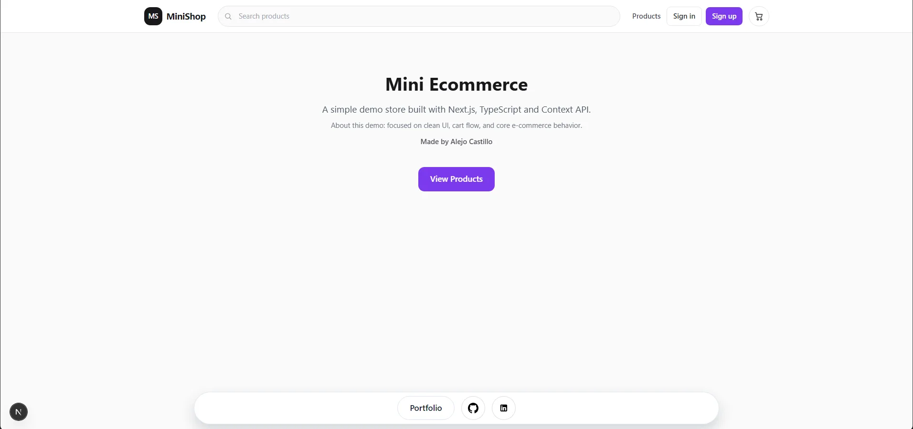
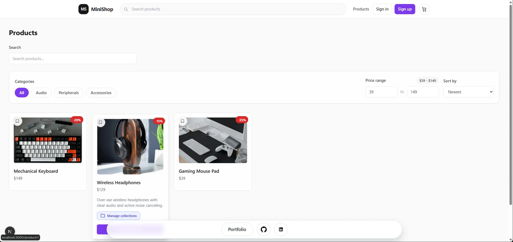
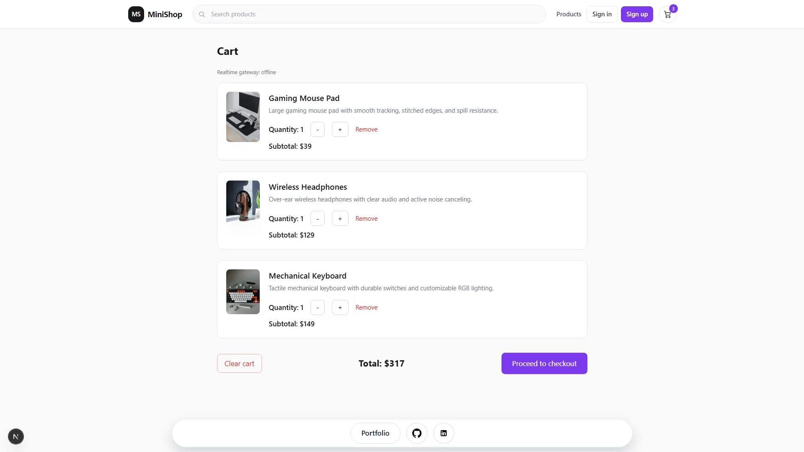
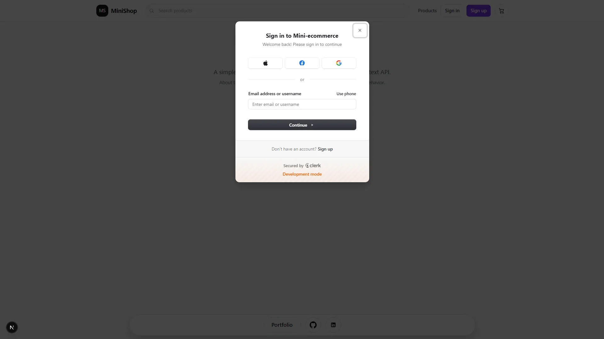

# Mini Ecommerce (Next.js)

[](.github/workflows/ci.yml) [](https://mini-ecommerce-nextjs-psi.vercel.app/)

Ecommerce demo on Next.js App Router: catalog, checkout, **Clerk** auth, and production-style persistence. **Cart on Redis**, **orders on Postgres/Prisma**, same public API after that split. Stripe Checkout (test mode), Vitest + Playwright, GitHub Actions CI.

**Live:** [mini-ecommerce-nextjs-psi.vercel.app](https://mini-ecommerce-nextjs-psi.vercel.app)

## Screenshots

| Home | Product catalog | Cart | Clerk sign-in |
|:---:|:---:|:---:|:---:|
|  |  |  |  |

## What it shows

- Product catalog with SSG/ISR detail pages, search, and filters
- Session cart (Redis) and multi-step checkout
- Stripe Checkout in test mode (webhook → Prisma order), with a demo path when keys are absent
- Order idempotency via `Idempotency-Key` on `POST /api/orders`
- Clerk sign-in/up, protected account routes, per-user order history
- Typed HTTP client (timeout, retry, errors) and Server Action cart sync
- REST + GraphQL surfaces; optional WebSocket demo
- Sentry hooks, error boundaries, structured API logs
- Docker Compose for local Postgres/Redis; CI with Postgres service + Playwright E2E

Deeper notes: [`docs/frontend-architecture.md`](docs/frontend-architecture.md), [`docs/testing-strategy.md`](docs/testing-strategy.md).

## Stack

- Next.js 16 (App Router), React 19, TypeScript, Tailwind CSS
- Clerk, Prisma + Neon Postgres, Redis
- Stripe (test), Vitest, Playwright, GitHub Actions
- Docker Compose

## Design choices worth noticing

| Concern | Choice |
|---------|--------|
| Cart | Redis (or in-memory without `REDIS_URL`) |
| Orders | Postgres via Prisma (`Order`, `OrderItem`, idempotency records) |
| Catalog | Server-loaded listing + SSG/ISR product pages |
| Cart writes | Server Action (`syncCartAction`) instead of client `PUT` |

## Run locally

```bash
npm install
cp .env.example .env.local
# add Clerk keys; DATABASE_URL for orders; REDIS_URL optional
npm run db:migrate
npm run dev
```

Open [http://localhost:3000](http://localhost:3000).

```bash
npm run ci          # lint, type-check, test, build
npm run ci:full     # above + Playwright E2E
docker compose up --build   # full local stack
```

Env reference: [`.env.example`](./.env.example).
